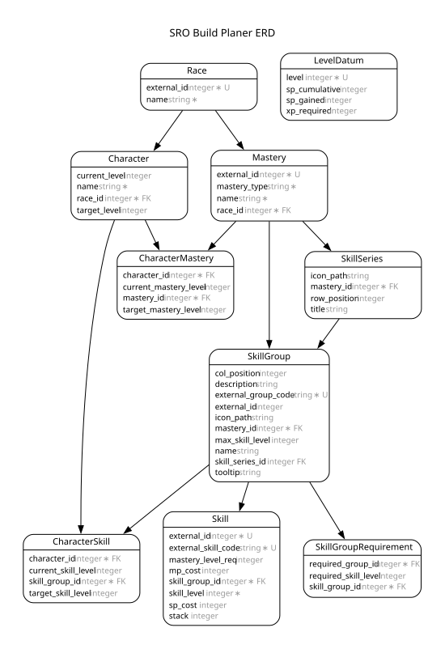

This is a Silkroad online skill planner

# README

[](https://codespaces.new/luciotbc/sro-build-planer)

This README would normally document whatever steps are necessary to get the
application up and running.

Things you may want to cover:

### Dependency

- Ruby: 4.0.2

### Getting Started

1. Clone the repository
2. Install dependencies using `bundle install`
3. Enable git hooks: `git config core.hooksPath .githooks`
4. Run the application using `bin/dev`

### Database



To regenerate the diagram after schema changes:

```bash
bin/rails docs:erd
```
