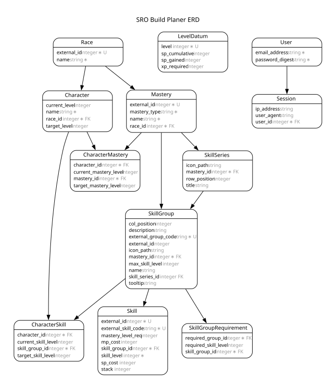

This is a Silkroad online skill planner

# README

[](https://codespaces.new/luciotbc/sro-build-planer)

This README would normally document whatever steps are necessary to get the
application up and running.

Things you may want to cover:

### Dependency

- Ruby: 4.0.2
- [oxipng](https://github.com/oxipng/oxipng): lossless PNG optimizer used by the pre-commit hook (`brew install oxipng`)

### Getting Started

1. Clone the repository
2. Install dependencies using `bundle install`
3. Install oxipng: `brew install oxipng`
4. Enable git hooks: `git config core.hooksPath .githooks`
5. Run the application using `bin/dev`

### Database



To regenerate the diagram after schema changes:

```bash
bin/rails docs:erd
```

### Design System

The design system is a living, in-app reference served at `/docs/design_system` (`DocsController#design_system`, view `app/views/docs/design_system.html.erb`, development-only). Every component is a real `app/views/shared` partial styled by `@layer components` classes in `app/assets/tailwind/application.css`, so the docs cannot drift from production.
